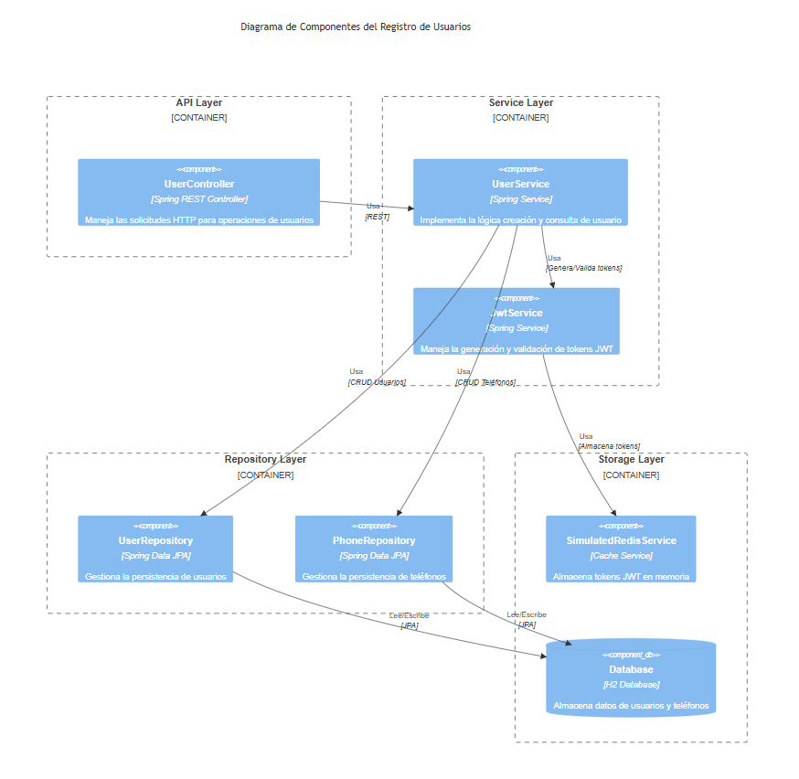
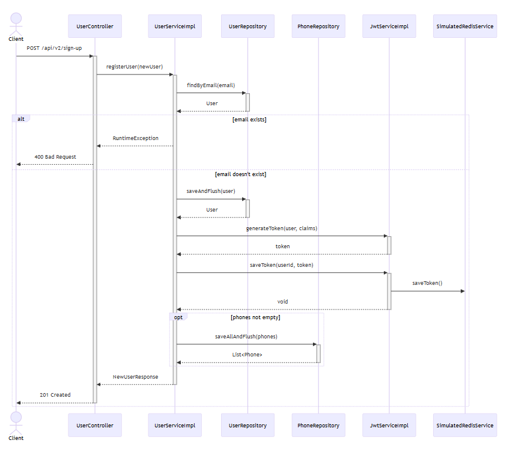
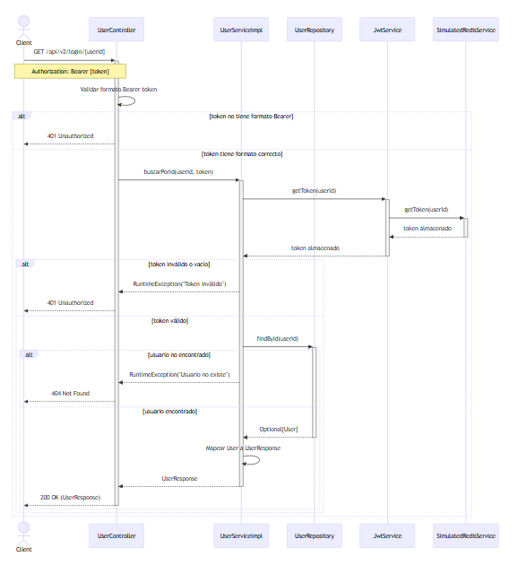

# API de Creación y consulta de usuario
## Requisitos Previos

Para ejecutar este proyecto, necesitas tener instalado:

- Java 11 o superior
- Gradle 7.x o superior
- Un IDE compatible con Spring Boot y Lombok (recomendado: IntelliJ IDEA o Eclipse)

## Características Principales

- Registro de usuarios con validación de datos 
- Autenticación mediante tokens JWT
- Gestión de información de contacto (teléfonos)
- Almacenamiento en caché de tokens mediante un servicio Redis simulado
- Persistencia de datos utilizando JPA y H2 Database

## Diagrama de componentes

## Diagramas de secuencia
- creación de usuario

- consulta de usuario


## Configuración del Proyecto

1. Clona el repositorio:
   ```bash
   git clone https://github.com/MariaUgas/evalMaun01.git
   ```

2. Navega al directorio del proyecto:

3. Compila el proyecto:
   ```bash
   ./gradlew clean build
   ```

## Estructura del Proyecto

El proyecto sigue una arquitectura en capas bien definida:

```
src/
├── main/
│   ├── java/
│   │   └── com/
│   │       └── example/
│   │           └── maun/
│   │               ├── cache/         # Simulacion redis
│   │               ├── controller/    # Controladores REST
│   │               ├── service/       # Lógica de negocio
│   │               ├── repository/    # Acceso a datos
│   │               ├── entity/        # Entidades JPA
│   │               └── dto/           # Objetos de transferencia de datos
│   └── resources/
│       └── application.properties     # Configuración de la aplicación
└── test/
    └── java/                         # Tests unitarios
```

## API Endpoints

### Registro de Usuario
- **POST** `/api/v2/sign-up`
  ```json
  {
    "name": "string",
    "email": "string",
    "password": "string",
    "phones": [
      {
        "number": "long",
        "citycode": "integer",
        "countrycode": "string"
      }
    ]
  }
  ```

### Consulta de Usuario
- **GET** `/api/v2/login/{userId}`
   - Headers requeridos:
      - Authorization: Bearer {token}
 
 NOTA: los valores requeridos para la consulta los obtiene al crear un usuario.

## Seguridad

La aplicación implementa varios niveles de seguridad:

- Validación de correo electrónico único
- Contraseñas seguras con requisitos específicos
- Tokens JWT para autenticación
- Almacenamiento seguro de contraseñas
- Control de acceso basado en tokens

## Testing

El proyecto incluye tests unitarios que cubren:

- Lógica de negocio en los servicios
- Validaciones en los controladores
- Manejo de tokens JWT
- Casos de éxito y error para cada operación

Para ejecutar los tests:
```bash
./gradlew test
```

## Configuración de Base de Datos

La aplicación utiliza H2 como base de datos integrada. La configuración se encuentra en `application.properties`:

```properties
spring.datasource.url=jdbc:h2:mem:testdb
spring.datasource.driverClassName=org.h2.Driver
spring.datasource.username=sa
spring.datasource.password=
spring.jpa.database-platform=org.hibernate.dialect.H2Dialect
```
## Soporte

Para soporte y preguntas, por favor contacta a:
- Email: marria42@gmail.com
